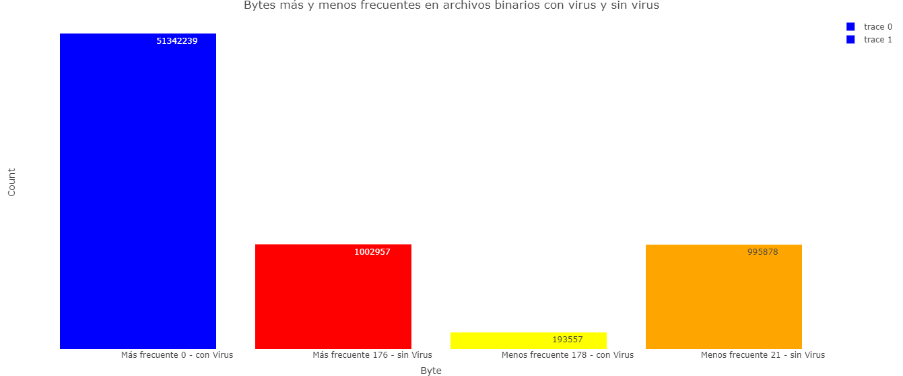
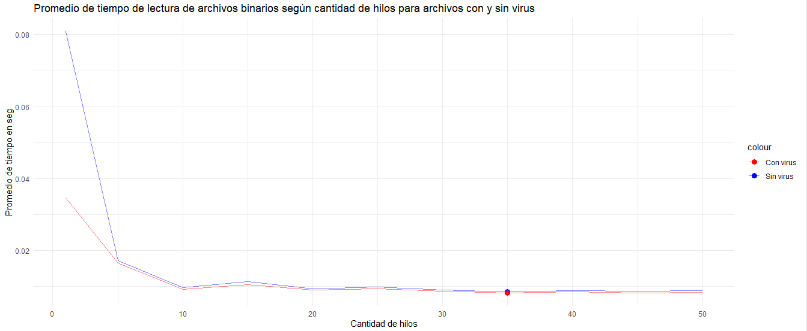

# Proyecto del curso Introducción a la Programación Paralela

- **Estudiantes:**
  - Emilio Chang Bustamante @ [emilio.chang.bustamante@est.una.ac.cr](mailto:emilio.chang.bustamante@est.una.ac.cr)
  - Isaac Fabián Palma Medina @ [isaac.palma.medina@est.una.ac.cr](mailto:isaac.palma.medina@est.una.ac.cr)
  - Karla Verónica Quirós Delgado @ [karla.quiros.delgado@est.una.ac.cr](mailto:karla.quiros.delgado@est.una.ac.cr)
- **Curso:** Introducción a la Programación Paralela, Escuela de Informática, Universidad Nacional
- **Docente:** Mag. Irene Hernández Ruiz

# Objetivo del proyecto

Convertir un programa secuencial a uno que utilice hilos, con la finalidad de estudiar las diferencias de rendimiento entre ambas metodologías.

# Programa a convertir

Contador de bytes escrito en C, para comparar el rendimiento entre contar de forma secuencial y de manera completamente paralela, esto para identificar si existe una correlación entre la cuenta de bytes de archivos maliciosos y archivos comunes.

# Q&A

   Se recomienda precaución al ejecutar el código o descargar este proyecto, dado que implica el análisis de archivos maliciosos. Se sugiere ejecutar el código en un entorno seguro y controlado.
    
    
   Caution is advised when running the code or downloading this project, as it involves the analysis of malicious files. It is suggested to run the code in a safe and controlled environment.

## ¿Por qué es importante este tema?

Este tema es crucial debido a que encontrar una correlación entre la frecuencia de aparición de ciertos bytes en archivos maliciosos podría permitir una identificación más eficiente de estos archivos. Implementar la paralelización en la lectura de archivos podría mejorar significativamente esta capacidad.

## ¿Qué tipo de archivos se están analizando? ¿Cuál es su origen?

Los archivos bajo análisis son aquellos clasificados como maliciosos, obtenidos de un repositorio de malware propiedad de [Virus Samples](https://github.com/MalwareSamples/Linux-Malware-Samples?tab=readme-ov-file). Estos archivos son binarios ejecutables de Linux (Linux ELF Binaries).

En cuanto a los archivos sin virus, fueron generados mediante un script propio en Python, que crea archivos binarios llenos de bytes y de tamaño similar a los archivos maliciosos.

## Resultados

### Bytes más comunes según el tipo de archivo

### Mejora en el rendimiento al aplicar paralelización

